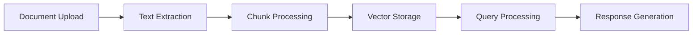

<div align="center">

# LISA AI 🤖
### Special Education Multidisciplinary Psychoeducational Report Assistant


[](https://python.org)
[](https://github.com/joaomdmoura/crewAI)
[](https://streamlit.io)
[](https://opensource.org/licenses/MIT)

</div>

---

## 🌟 Overview

LISA AI is a cutting-edge AI-powered assistant designed to revolutionize special education report writing. Using advanced language models and RAG (Retrieval Augmented Generation) technology, LISA AI helps educators analyze student documents and generate comprehensive psychoeducational reports.

### ✨ Key Features

- 🤖 **Interactive Chat Interface**: Engage in natural conversations about student data
- 📄 **Multi-Format Support**: Process PDF, DOCX, and TXT documents
- 📊 **Comprehensive Analysis**: Extract key insights from educational documents
- 📝 **Report Generation**: Create structured, professional reports
- 🔒 **Secure Processing**: Local document handling with privacy in mind
- 💡 **Smart Context Understanding**: Leverages RAG for accurate information retrieval

## 🚀 Quick Start

### Prerequisites

- Python 3.10+
- Conda (recommended for environment management)
- OpenAI API key

### Installation

1. **Clone the repository**

```bash
git clone https://github.com/FabioVinelli/Lisa-AI-RAG-AGENT-Crew.git
cd lisa-ai
```

2. **Create and activate conda environment**

```bash
conda create -n lisa-ai python=3.10
conda activate lisa-ai
```

3. **Install dependencies**

```bash
pip install -r requirements.txt
```

4. **Set up environment variables**
Create a `.env` file in the root directory:

```env
OPENAI_API_KEY=your_api_key_here
```

### Running the Application

1. **Start the Streamlit app**

```bash
streamlit run app.py
```

2. **Access the web interface**
- Open your browser
- Navigate to `http://localhost:8501`

## 💻 Usage Guide

1. **Start a New Session**
   - Click "Start New Session" to begin
   - Each session maintains isolated document context

2. **Upload Documents**
   - Support for PDF documents
   - Secure local processing
   - Automatic content extraction

3. **Interactive Analysis**
   - Ask questions about the student
   - Get detailed, context-aware responses
   - Natural language interaction

4. **Report Generation**
   - Click "Generate Report" for comprehensive analysis
   - Structured format following educational standards
   - Professional language and formatting

## 🏗️ Architecture

LISA AI leverages several key technologies:

- **CrewAI**: Multi-agent orchestration
- **LangChain**: Document processing and RAG implementation
- **Streamlit**: User interface and interaction
- **OpenAI**: Language model integration

### RAG Implementation



## 📚 Documentation

For detailed documentation:
- [Setup Guide](docs/setup.md)
- [API Reference](docs/api.md)
- [User Guide](docs/user-guide.md)

## 🤝 Contributing

Contributions are welcome! Please feel free to submit a Pull Request. For major changes, please open an issue first to discuss what you would like to change.

1. Fork the Project
2. Create your Feature Branch (`git checkout -b feature/AmazingFeature`)
3. Commit your Changes (`git commit -m 'Add some AmazingFeature'`)
4. Push to the Branch (`git push origin feature/AmazingFeature`)
5. Open a Pull Request

## 📄 License

This project is licensed under the MIT License - see the [LICENSE](LICENSE) file for details.

## 🙏 Acknowledgments

- CrewAI team for the amazing framework
- OpenAI for language model support
- Streamlit for the intuitive UI framework

---

<div align="center">

Made with ❤️ by [Fabio Vinelli](https://github.com/FabioVinelli)

</div>